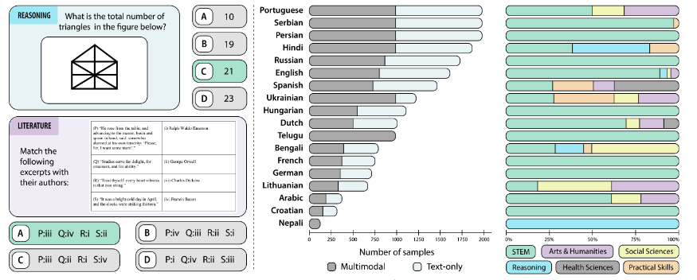

# Kaleidoscope: In-language Exams for Massively Multilingual Vision Evaluation

[](https://arxiv.org/abs/2504.07072)
[](https://hf.co/datasets/CohereForAI/kaleidoscope)
[](http://cohere.com/research/kaleidoscope)

Official repository for *Kaleidoscope*, **a comprehensive multilingual multimodal exam benchmark** evaluating VLMs across:
- **18 languages** (Bengali → Spanish)
- **14 subjects** (STEM to Humanities) 
- **20,911 questions** (55% requiring image understanding)

<p align="center">
  
</p>

## 🚀 Quick Start
```python
from datasets import load_dataset
dataset = load_dataset(CohereForAI/kaleidoscope)
```

## 🛠️ Evaluation
Running Inference
```python
python main.py \
--model <model_name> \
--dataset <dataset_name_or_path> \
--model_path <model_path> \
--api_key <api-if-needed>
```

## Citation
If you find this useful in your research, please consider citing it:

```
@misc{salazar2025kaleidoscopeinlanguageexamsmassively,
      title={Kaleidoscope: In-language Exams for Massively Multilingual Vision Evaluation}, 
      author={Israfel Salazar and Manuel Fernández Burda and Shayekh Bin Islam and Arshia Soltani Moakhar and Shivalika Singh and Fabian Farestam and Angelika Romanou and Danylo Boiko and Dipika Khullar and Mike Zhang and Dominik Krzemiński and Jekaterina Novikova and Luísa Shimabucoro and Joseph Marvin Imperial and Rishabh Maheshwary and Sharad Duwal and Alfonso Amayuelas and Swati Rajwal and Jebish Purbey and Ahmed Ruby and Nicholas Popovič and Marek Suppa and Azmine Toushik Wasi and Ram Mohan Rao Kadiyala and Olga Tsymboi and Maksim Kostritsya and Bardia Soltani Moakhar and Gabriel da Costa Merlin and Otávio Ferracioli Coletti and Maral Jabbari Shiviari and MohammadAmin farahani fard and Silvia Fernandez and María Grandury and Dmitry Abulkhanov and Drishti Sharma and Andre Guarnier De Mitri and Leticia Bossatto Marchezi and Johan Obando-Ceron and Nazar Kohut and Beyza Ermis and Desmond Elliott and Enzo Ferrante and Sara Hooker and Marzieh Fadaee},
      year={2025},
      eprint={2504.07072},
      archivePrefix={arXiv},
      primaryClass={cs.CL},
      url={https://arxiv.org/abs/2504.07072}, 
}
```